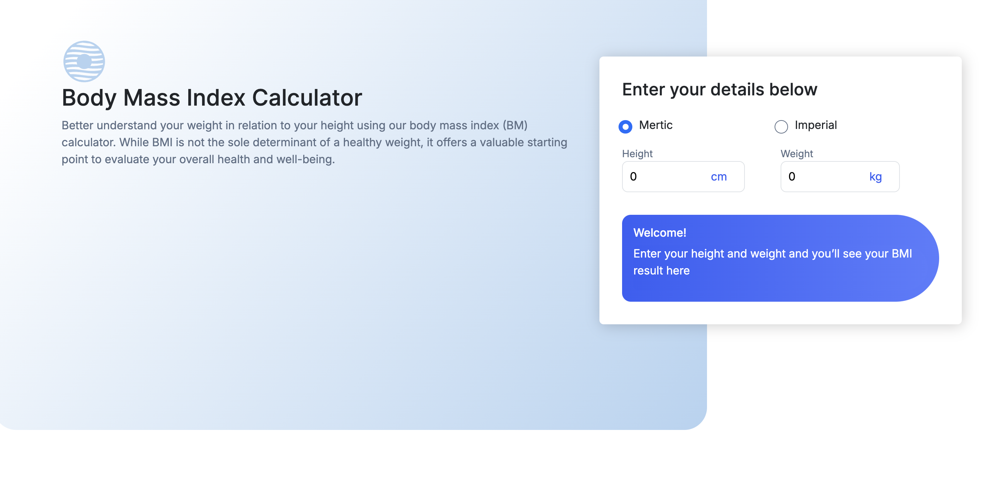
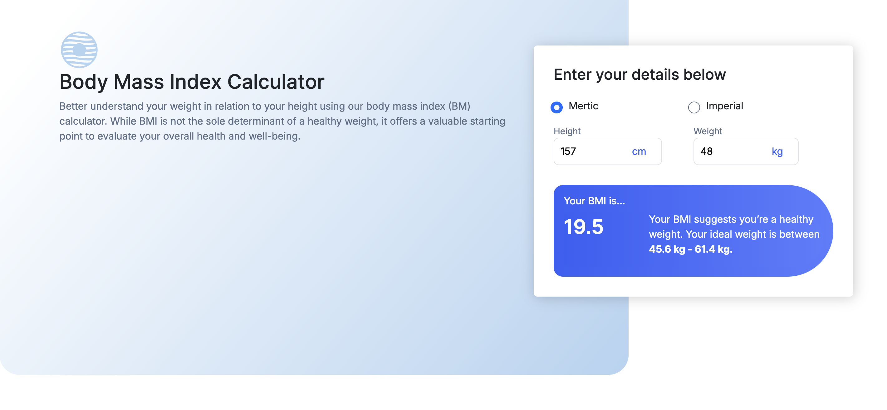
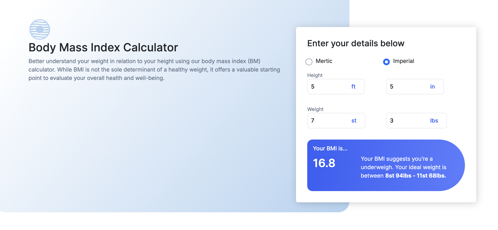
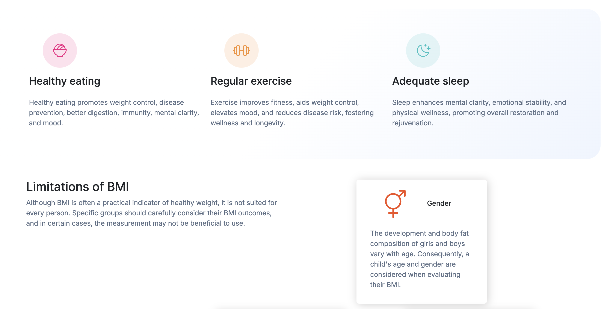

# Aqwas Task - Body Mass Index Calculator solution

## Table of contents

- [Overview](#overview)
  - [Screenshot](#screenshot)
  - [Links](#links)
- [My process](#my-process)
  - [Built with](#built-with)

## Overview

### The challenge

Users should be able to:

- Select whether they want to use metric or imperial units
- Enter their height and weight
- See their BMI result, with their weight classification and healthy weight range
- View the optimal layout for the interface depending on their device's screen size
- See hover and focus states for all interactive elements on the page

### Screenshot

### Links

- Live Site URL: [BMI Calculator](https://lamalqahtani.github.io/bmi-calculator/src/)

## My process

1. Setup the project environment.
2. Build the basic HTML
3. Styling
4. Scripting
5. Enhancement

### Built with

- Semantic HTML5 markup
- CSS custom properties
- Flexbox
- CSS Grid
- Bootstrap
- Vanilla Javascript
